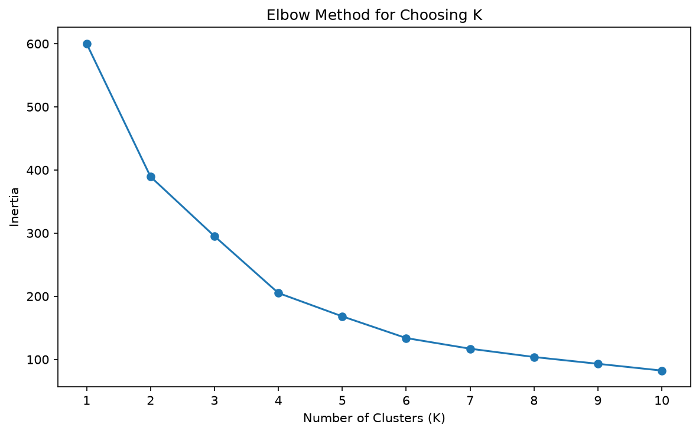
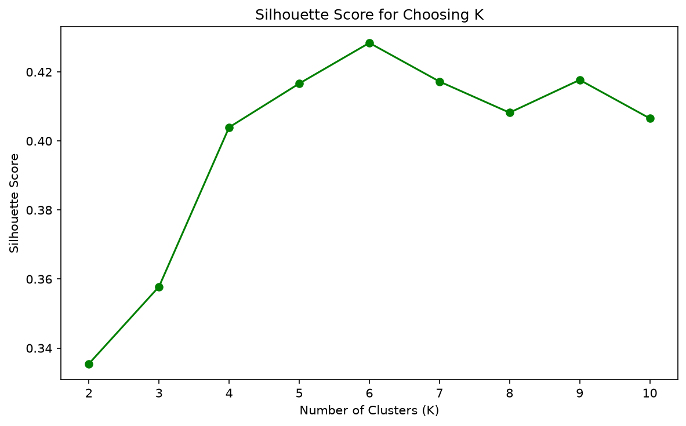
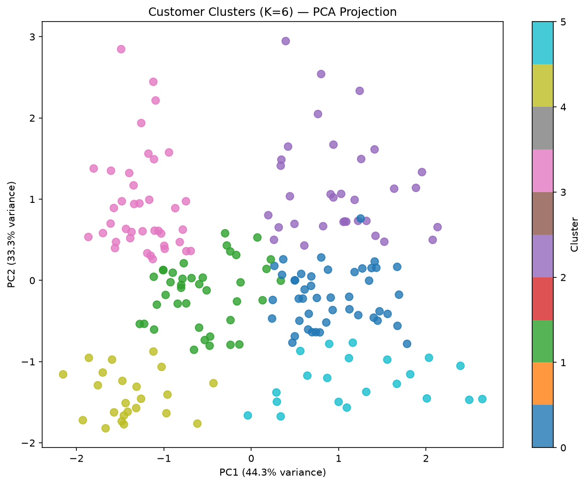
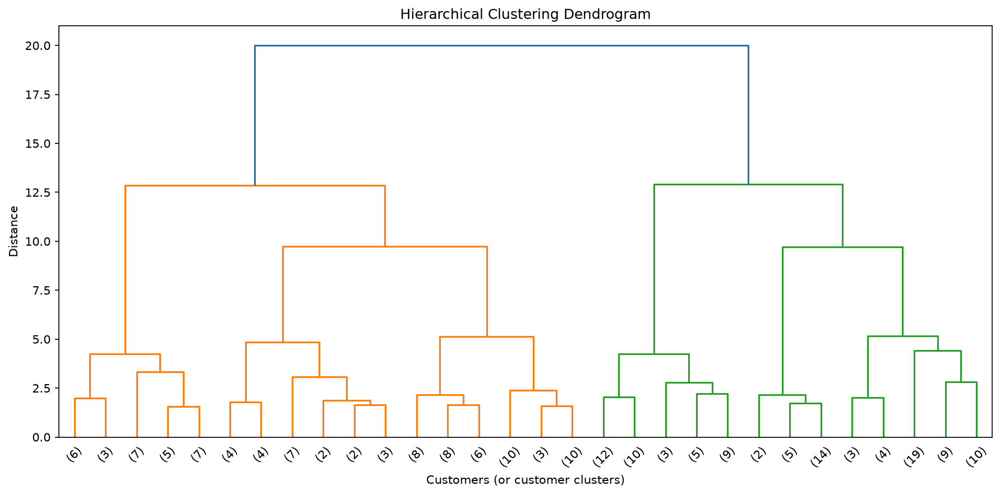

# Customer Segmentation with Clustering

A small unsupervised learning project: given a spreadsheet of mall
customers (age, income, spending score), find natural groups of similar
customers without telling the algorithm what those groups should be.

## What it does

1. Loads and explores the data (200 customers, no missing values)
2. Scales the features (age, income, spending score are on very different
   numeric ranges, which matters a lot for clustering)
3. Uses the elbow method and silhouette score to figure out how many
   clusters actually make sense, rather than just guessing a number
4. Runs K-means to sort customers into clusters, and PCA to visualize them
   in 2D
5. Labels each cluster in plain English based on what its customers
   actually look like
6. Cross-checks the result with a second, completely different algorithm
   (hierarchical clustering), to see if it finds the same groups

## The data

`Mall_Customers.csv` — CustomerID, Gender, Age, Annual Income (k$),
Spending Score (1-100). 200 rows.

## Results

### Choosing K




Both point to **K=6** as a good number of clusters.

### The clusters



| Cluster | Age | Income | Spending | Count | Description |
|---|---|---|---|---|---|
| 3 | 32.7 | 86.5 | 82.1 | 39 | High income, high spending — best customers |
| 2 | 41.9 | 88.9 | 17.0 | 33 | High income, low spending |
| 4 | 25.0 | 25.3 | 77.6 | 23 | Young, low income, high spending |
| 5 | 45.5 | 26.3 | 19.4 | 21 | Older, low income, low spending |
| 0 | 56.3 | 54.3 | 49.1 | 45 | Older, average income and spending |
| 1 | 26.8 | 57.1 | 48.1 | 39 | Young, average income and spending |

Clusters 0 and 1 have almost identical income and spending, and only
differ by age — which is a nice sign that including age 
actually added something to the project.

### Checking the result with a second method



Ran hierarchical clustering on the same data and compared it to the
K-means result. Adjusted Rand Index: **0.891** — strong agreement. Five of
the six clusters matched up almost one-to-one between both methods, one
smaller cluster (the young/low-income/high-spending group) showed some
disagreement.

## Running it

```bash
pip install -r requirements.txt
python customer_segmentation.py
```

## Stack

Python, pandas, NumPy, scikit-learn, SciPy, Matplotlib, Seaborn
